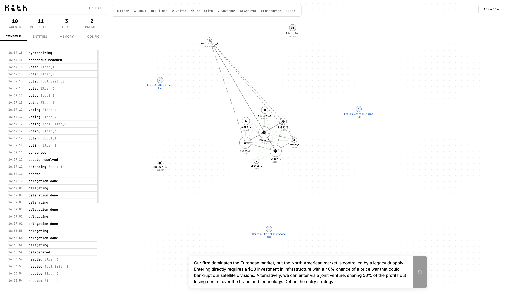

<p align="center">
  
</p>

<p align="center">
  <strong>Decision intelligence through a persistent, self-governing AI society.</strong>
</p>

<p align="center">
  <a href="#quick-start">Quick Start</a> ·
  <a href="#how-it-works">How It Works</a> ·
  <a href="#api">API</a> ·
  <a href="#configuration">Configuration</a>
</p>

---

Kith is a decision-making engine built on a persistent society of AI agents. Instead of routing your question to a single model, Kith mobilizes a society that deliberates, debates, delegates, and reaches consensus — producing decisions that are more robust, more diverse, and more thoroughly examined than any single agent could achieve.

The society persists across sessions. It develops internal policies from observed problems, promotes high-performing agents and retires underperformers, builds bilateral trust relationships between members, and periodically self-reflects on its own decision quality. Every decision is informed by vectorized institutional memory — not a static summary, but semantically retrieved facts relevant to the question at hand.

Internal communication uses [caveman](https://github.com/JuliusBrussee/caveman) compression (~70% token savings). Reasoning is governed by [Meta-Reasoning](https://github.com/tictacguy/meta-reasoning), an SDK that controls cognitive dynamics through formal policies and mutation operators. The final response to the user is always clear, well-structured prose.

## Why Kith?

Traditional AI assistants give you one perspective from one model. Kith gives you a **decision process**:

- A **Scout** explores unconventional angles your team might miss
- A **Critic** finds flaws in the reasoning before you act on it
- A **Builder** translates abstract ideas into concrete implementation plans
- An **Elder** synthesizes conflicting viewpoints into a coherent recommendation
- A **Tool Smith** analyzes patterns and proposes new tools for the society
- A **Governor** enforces quality standards and mediates unresolved disputes
- An **Analyst** provides data-driven insights and quantitative evaluation

The society doesn't just answer — it **argues, challenges, and converges**. You see the final recommendation, but behind it is a structured process of mobilization, deliberation, debate, and weighted consensus.

## Frontend

<p align="center">
  
</p>

The interface is a real-time visualization of the society. A D3 force-directed graph shows agents as nodes, bilateral relationships as colored links (green for allies, red for rivals), and tools as blue nodes. Everything updates live via WebSocket — no polling.

- **Graph canvas** — drag, zoom, click any agent to inspect. Historian visible as a system entity (◑)
- **Console tab** — live event feed: mobilization, deliberation, debate, consensus, evolution events
- **Entities tab** — agent list with reputation scores, role badges, rename and reassign controls
- **Memory tab** — vectorized facts, retrospective reports, society summary
- **Config tab** — switch LLM provider and model at runtime with one click
- **Chat input** — bottom-center of the canvas, auto-grows as you type
- **Response sheet** — slides up from the bottom with the final synthesized recommendation

## Quick Start

### Docker Hub

```bash
docker run -d \
  --name kith \
  -p 8000:8000 \
  -v kith_data:/data/kith \
  -e KITH_LLM_BACKEND=openai \
  -e OPENAI_API_KEY=your_key \
  -e KITH_LLM_MODEL=gpt-4o \
  tictacguy/kith:latest
```

### GitHub Container Registry

```bash
docker run -d \
  --name kith \
  -p 8000:8000 \
  -v kith_data:/data/kith \
  -e KITH_LLM_BACKEND=openai \
  -e OPENAI_API_KEY=your_key \
  -e KITH_LLM_MODEL=gpt-4o \
  ghcr.io/tictacguy/kith:latest
```

Open `http://localhost:8000`.

### Docker Compose

```bash
git clone https://github.com/tictacguy/kith.git
cd kith
cp .env.example .env
# Edit .env with your provider credentials
docker compose up -d
```

### From Source

```bash
git clone https://github.com/tictacguy/kith.git
cd kith
pip install -e ".[dev]"
uvicorn kith.main:app --port 8000 --reload

# Frontend (separate terminal)
cd frontend && npm install && npm run dev
```

## How It Works

### Decision Lifecycle

Every question goes through a structured decision process. The depth of the process scales automatically with the complexity of the question.

```
Question arrives
       │
  MOBILIZATION ── each agent self-evaluates relevance
       │           simple question → 1 agent responds directly
       │           complex question → full society mobilizes
       │
  INITIAL ANALYSIS ── activated agents reason independently
       │
  DELIBERATION ── agents read each other's positions and react
       │           can DELEGATE sub-tasks to better-suited peers
       │           can DISAGREE and trigger structured debates
       │
  DEBATE ── disagreeing pairs argue with evidence
       │    Governor mediates and rules
       │
  CONSENSUS ── agents vote (weighted by reputation)
       │        high-reputation agents have more influence
       │
  SUPERVISION ── supervisors review subordinate positions
       │
  SYNTHESIS ── final recommendation in clear prose
       │
  HISTORIAN ── extracts facts, updates vectorized memory
       │
  RETROSPECTIVE ── society self-reflects every 10 decisions
```

### Vectorized Memory

The Historian extracts discrete facts from every interaction and vectorizes them individually in ChromaDB. When a new question arrives, only semantically relevant facts are retrieved — no global summary polluting unrelated decisions.

Facts include rich metadata: participating agents, themes, tools used, society stage. The society summary displayed in the UI is reconstructed from recent facts for human readability, but is never injected into agent prompts.

### Storage

- **SQLite** — structured state (agents, roles, tools, policies, interactions)
- **ChromaDB** — vectorized memory (all-MiniLM-L6-v2 via built-in ONNX)

### LLM Providers

Switchable at runtime from the frontend config panel.

| Provider | Variables |
|----------|-----------|
| OpenAI | `OPENAI_API_KEY` |
| Anthropic | `ANTHROPIC_API_KEY` |
| AWS Bedrock | `AWS_BEARER_TOKEN_BEDROCK`, `AWS_REGION` |
| Ollama | `OLLAMA_BASE_URL` (default: `http://localhost:11434/v1`) |

## Configuration

All via environment variables or `.env` file.

| Variable | Description | Default |
|----------|-------------|---------|
| `KITH_LLM_BACKEND` | `openai` / `anthropic` / `bedrock` / `ollama` | `bedrock` |
| `KITH_LLM_MODEL` | Model name | `claude-3-5-haiku-20241022` |
| `KITH_LLM_MAX_TOKENS` | Max tokens for internal agent calls | `1024` |
| `KITH_DATA_DIR` | Persistent data directory | `/data/kith` |
| `CAVEMAN_INTENSITY` | Default compression: `lite` / `full` / `ultra` | `full` |

## API

All endpoints under `/api/v1/`. Real-time events via WebSocket at `/ws`.

| Method | Endpoint | Description |
|--------|----------|-------------|
| `POST` | `/prompt` | Submit a decision question |
| `GET` | `/society` | Society state |
| `GET` | `/agents` | List agents |
| `PATCH` | `/agents/{id}/name` | Rename |
| `PATCH` | `/agents/{id}/status` | Set active/dormant/retired |
| `PATCH` | `/agents/{id}/role` | Reassign role |
| `GET` | `/roles` | List roles |
| `GET` | `/tools` | List tools |
| `POST` | `/tools/propose` | Tool Smith proposals |
| `POST` | `/tools/register` | Register tool |
| `GET` | `/policies` | List policies |
| `POST` | `/policies` | Add policy |
| `PATCH` | `/policies/{id}` | Update policy |
| `POST` | `/society/evolve` | Force evolution check |
| `POST` | `/society/reset` | Reset to primitive |
| `GET` | `/config/llm` | Current LLM config |
| `PUT` | `/config/llm` | Switch provider at runtime |
| `GET` | `/memory/search?q=` | Semantic memory search |
| `GET` | `/interactions/recent` | Recent interactions |
| `WS` | `/ws` | Real-time event stream |

## License

AGPL-3.0
